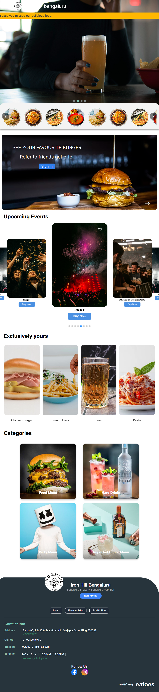
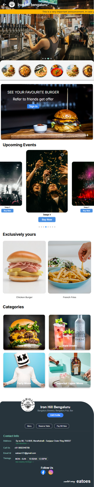

# React + Vite

## Project Name: Components Iron Hill Bengaluru

#### Live url: https://eatoes-iron-hill-project.vercel.app/


## Description

This project is the **homepage of Iron Hill Bengaluru**, designed with responsive layouts to ensure optimal viewing across devices of all screen sizes—large (desktop), medium (tablet), and small (mobile). It demonstrates my skills in responsive web design and development.

---

## Features

- Fully responsive design
- Optimized for large, medium, and small screen sizes
- User-friendly layout and navigation
- Clean, modern UI

---

## Technologies Used

- **HTML5**
- **CSS3**
- **JavaScript**
- **React**
- **Responsive Web Design** (Media Queries, Flexbox, Grid)

---

## Screenshots

### Large Screen (Desktop)


---

### Medium Screen (Tablet)



---

### Small Screen (Mobile)



---

## Setup and Installation

1. Clone the repository:
   ```bash
   git clone https://github.com/BASHISTHANAYAK/Eatoes_IronHill_Project.git
   ```

## Navigate to the project directory:

```bash
cd Eatoes_IronHill_Project
```

## Install dependencies:

```bash
npm install
```

## Start the development server:

```bash
npm run dev
```
